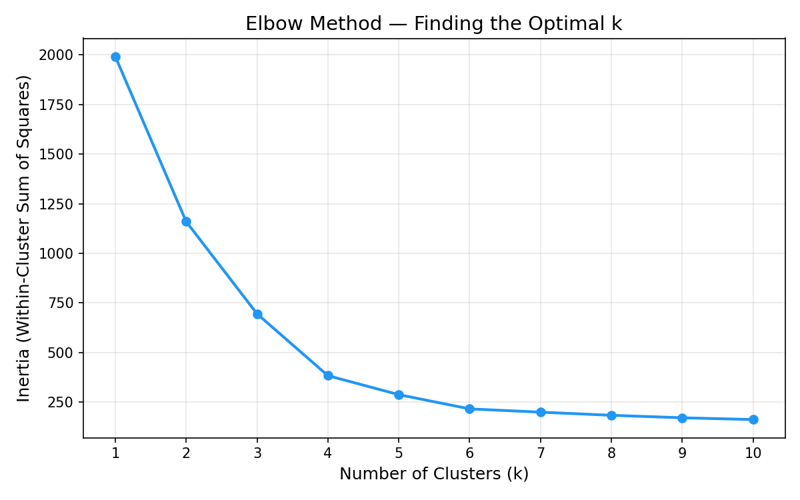
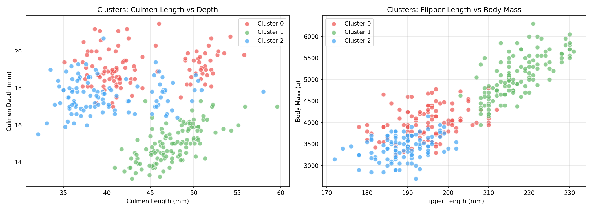

# Penguin Species Clustering — Unsupervised Learning

An unsupervised machine learning project that uses **K-Means clustering** to identify penguin species groups from physical measurement data, without any species labels.

## Background

A team of researchers at Palmer Station, Antarctica collected physical measurements of penguins but were unable to record the species. Three species are known to be native to the region: **Adelie**, **Chinstrap**, and **Gentoo**. This project applies clustering to discover natural groupings in the data that likely correspond to these species.

**Data source:** Dr. Kristen Gorman and the Palmer Station, Antarctica LTER (Long Term Ecological Research Network).

## Dataset

The dataset contains **332 penguin observations** with 5 features:

| Column | Description |
|--------|-------------|
| `culmen_length_mm` | Culmen (bill) length in millimeters |
| `culmen_depth_mm` | Culmen (bill) depth in millimeters |
| `flipper_length_mm` | Flipper length in millimeters |
| `body_mass_g` | Body mass in grams |
| `sex` | Penguin sex (MALE / FEMALE) |

## Methodology

1. **Preprocessing** — Converted the categorical `sex` column into dummy variables using `pd.get_dummies()`, then standardized all features with `StandardScaler` so no single measurement dominates the clustering.

2. **Elbow Analysis** — Ran K-Means for k = 1 through 10 and plotted inertia to find the optimal number of clusters. The elbow appeared at **k = 3**, consistent with the three known species.



3. **K-Means Clustering** — Applied K-Means with k = 3 to assign each penguin to a cluster.



4. **Cluster Summary** — Computed mean values per cluster to profile each group.

## Results

| Cluster | Culmen Length | Culmen Depth | Flipper Length | Body Mass | Sex |
|---------|--------------|-------------|---------------|-----------|-----|
| 0 | 43.9 mm | 19.1 mm | 194.8 mm | 4,007 g | All Male |
| 1 | 47.6 mm | 15.0 mm | 217.2 mm | 5,092 g | Mixed |
| 2 | 40.2 mm | 17.6 mm | 189.0 mm | 3,419 g | All Female |

**Key findings:**
- Cluster 1 stands out with significantly longer flippers and higher body mass, likely representing **Gentoo** penguins.
- Clusters 0 and 2 separated primarily by sex, with similar bill and flipper proportions — these likely represent male and female **Adelie/Chinstrap** penguins.

## Tech Stack

- Python
- pandas
- scikit-learn (KMeans, StandardScaler)
- matplotlib
- numpy

## How to Run

```bash
# Install dependencies
pip install pandas numpy scikit-learn matplotlib

# Run the analysis
python penguin_clustering.py
```

## Project Structure

```
├── README.md
├── penguins.csv                # Raw dataset
├── penguin_clustering.py       # Full analysis script
├── elbow_plot.png              # Elbow method visualization
├── cluster_scatter.png         # Cluster scatter plots
└── stat_penguins.csv           # Cluster summary statistics
```

## Author

**Matthew** — [GitHub](https://github.com/Matthewtemie)

Built as part of a machine learning skill-building journey. 🐧
